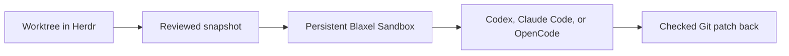

# Blaxel Sandbox for Herdr

[](https://github.com/blaxel-ai/herdr-blaxel-sandbox-plugin/actions/workflows/ci.yml)
[](https://herdr.dev/plugins/)
[](https://docs.blaxel.ai/Sandboxes/Overview)
[](LICENSE)

Run Codex, Claude Code, or OpenCode in a persistent Blaxel Sandbox without leaving Herdr.

Your worktree stays local. The plugin sends a reviewed snapshot to Blaxel, keeps the agent running in a persistent remote session, and brings its changes back as a checked Git patch.



## Quick start

You need [Herdr 0.8.0 or newer](https://herdr.dev/docs/), [Node.js 22 or newer](https://nodejs.org/en/download), Git, and the [Blaxel CLI](https://docs.blaxel.ai/cli-reference/introduction#install).

Install the plugin:

```bash
herdr plugin install blaxel-ai/herdr-blaxel-sandbox-plugin
```

Then:

1. Open a Git worktree in Herdr.
2. Run **Start configured agent in Blaxel**.
3. Review the target, settings, and files that will be uploaded.
4. Run the same action again within ten minutes.
5. Work in the new **Blaxel agent** pane.

That is the complete default setup. The plugin uses Codex and your current Blaxel workspace unless you choose something else.

If you are signed out, Start opens the official Blaxel login flow. Sign in, then run Start again.

## What you get

- One persistent Sandbox for each worktree and agent pair.
- Built-in Codex, Claude Code, and OpenCode support.
- Reconnectable agent sessions that survive local terminal disconnects.
- Private application previews for common development ports.
- A checked Git patch when you bring remote changes back.
- A dashboard for every Sandbox tracked by the plugin.

## Choose an agent

Find the plugin's managed configuration directory:

```bash
herdr plugin config-dir blaxel.sandbox
```

Create `config.json` there with the agent you want:

```json
{
  "agent": "claude-code"
}
```

Use `codex`, `claude-code`, or `opencode`. Every setting is optional. See the [configuration reference](docs/configuration.md) for workspace, region, image, memory, preview, upload, and lifecycle options.

## Actions

| Action                               | What it does                                                            |
| ------------------------------------ | ----------------------------------------------------------------------- |
| **Start configured agent in Blaxel** | Reviews the upload, creates or reuses the Sandbox, and opens the agent. |
| **Reconnect to Blaxel agent**        | Reopens the persistent agent session.                                   |
| **Apply Blaxel changes locally**     | Checks and applies the next remote Git patch.                           |
| **Show Blaxel agent output**         | Shows recent terminal output without reconnecting.                      |
| **Open Blaxel previews**             | Opens private application previews for configured ports.                |
| **Open Blaxel dashboard**            | Shows every Sandbox tracked by the plugin.                              |
| **Stop Blaxel agent**                | Stops the agent session but keeps its Sandbox and files.                |
| **Replace Blaxel sandbox**           | Deletes the mapped Sandbox and creates a clean replacement.             |
| **Delete Blaxel sandbox**            | Permanently deletes the Sandbox and forgets its mapping.                |

You can run actions from Herdr's action picker, from a [keybinding](docs/keybindings.md), or from the CLI:

```bash
herdr plugin action invoke start-agent --plugin blaxel.sandbox
```

## Safety without friction

You see one complete review before the plugin creates a Sandbox or uploads files. Running Start again approves only that unchanged target and snapshot. If something material changes, the plugin shows a fresh review.

The plugin excludes Git-ignored files, dependencies, environment files, common credentials, private keys, cloud configuration, Terraform state, symlinks, and recognized token formats. It never copies host coding-agent credentials.

Remote edits stay remote until you choose **Apply Blaxel changes locally**. The plugin checks the complete binary Git patch before changing your worktree. A conflict changes nothing.

Only permanent replacement and deletion require a typed `DELETE`. Normal start, reconnect, stop, preview, and patch workflows do not.

## Learn more

- [Configuration](docs/configuration.md)
- [Keybindings](docs/keybindings.md)
- [Troubleshooting](docs/troubleshooting.md)
- [Design and lifecycle](docs/design.md)
- [Verification](docs/verification.md)
- [Contributing](CONTRIBUTING.md)
- [Herdr plugin documentation](https://herdr.dev/docs/plugins/)
- [Blaxel Sandbox documentation](https://docs.blaxel.ai/Sandboxes/Overview)

## Development

```bash
npm ci
npm run check
npm run test:coverage
npm audit
```

Version `0.1.0` is lifecycle-tested with Codex `0.147.0`, Claude Code `2.1.226`, and OpenCode `1.14.48`. See the [verification record](docs/verification.md) for the tested flows and evidence boundary.
