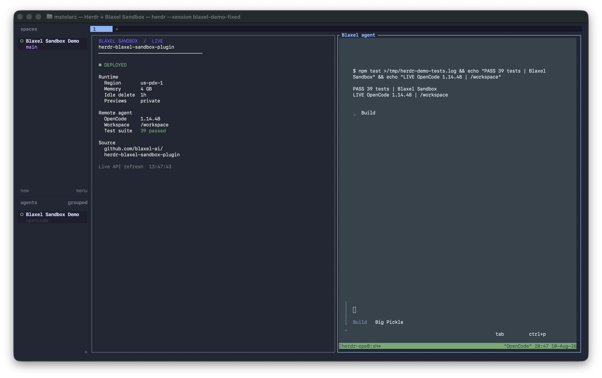
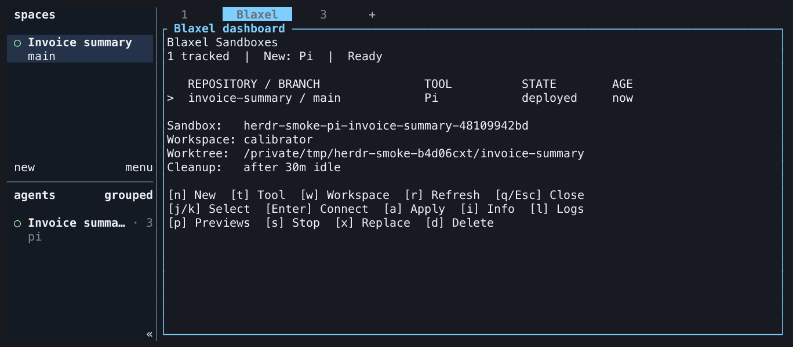
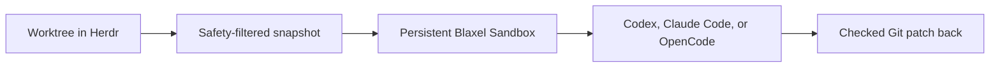

# Blaxel Sandbox for Herdr

[](https://github.com/blaxel-ai/herdr-blaxel-sandbox-plugin/actions/workflows/ci.yml)
[](https://herdr.dev/plugins/)
[](https://docs.blaxel.ai/Sandboxes/Overview)
[](LICENSE)

Run Codex, Claude Code, or OpenCode in a persistent Blaxel Sandbox without leaving Herdr.

Your worktree stays local. The plugin sends a safety-filtered snapshot to Blaxel, keeps the agent running in a persistent remote session, and brings its changes back as a checked Git patch.







## Quick start

You need [Herdr 0.8.0 or newer](https://herdr.dev/docs/), [Node.js 22 or newer](https://nodejs.org/en/download), Git, and the [Blaxel CLI](https://docs.blaxel.ai/cli-reference/introduction#install).

Install the plugin:

```bash
herdr plugin install blaxel-ai/herdr-blaxel-sandbox-plugin
```

Then:

1. Open a Git worktree in Herdr.
2. Run `herdr plugin action invoke start-agent --plugin blaxel.sandbox`.
3. Start immediately shows the target and filtered upload while it creates, uploads, sets up, and verifies the Sandbox.
4. Work in the new **Blaxel agent** pane.

That is the complete default setup. The plugin uses Codex and your current Blaxel workspace unless you choose something else.

If you are signed out, Start runs the official Blaxel login flow and then continues automatically.

## What you get

- Every `sbx` invocation creates an independent persistent Sandbox, even from the same worktree and pane.
- Built-in Codex, Claude Code, and OpenCode support.
- Reconnectable agent sessions that survive local terminal disconnects.
- Private application previews for common development ports.
- A checked Git patch when you bring remote changes back.
- A responsive repository-aware dashboard for creating, connecting, applying, inspecting, stopping, replacing, and deleting every tracked Sandbox.

## Choose an agent

Find the plugin's managed configuration directory:

```bash
herdr plugin config-dir blaxel.sandbox
```

Create `config.json` there with the agent you want:

```json
{
  "agent": "claude-code",
  "agentArgs": []
}
```

Use `codex`, `claude-code`, or `opencode`. Every setting is optional. See the [configuration reference](docs/configuration.md) for workspace, region, image, memory, preview, upload, and lifecycle options.

## Short commands

The plugin is complete after installation. If you want a short local command, add this optional Zsh function to `~/.zshrc`:

```zsh
sbx() {
  case "${1:-new}" in
    new)
      command herdr plugin action invoke start-agent --plugin blaxel.sandbox
      ;;
    list|ls|dashboard)
      command herdr plugin action invoke dashboard --plugin blaxel.sandbox
      ;;
    *)
      print -u2 "usage: sbx [new|list|dashboard]"
      return 2
      ;;
  esac
}
```

Reload Zsh, then run:

```bash
# Create a new Sandbox from the current Git worktree.
sbx
sbx new

# Manage every tracked Sandbox.
sbx list
```

Every `sbx` or `sbx new` creates another independent Sandbox. The function only shortens Herdr commands; the installed plugin owns all behavior.

## Dashboard

`sbx list` opens the primary management interface. It renders local mappings immediately, refreshes Blaxel state in the background, and shows each Sandbox's repository, branch, agent, state, age, workspace, version, and idle-deletion policy.

| Key                  | Action                                       |
| -------------------- | -------------------------------------------- |
| `Enter` or `c`       | Connect to the persistent agent              |
| `n`                  | Create another Sandbox for the selected repo |
| `a`                  | Review and apply remote changes locally      |
| `i`, `l`, or `p`     | Open info, logs, or previews                 |
| `s`                  | Stop the agent but preserve files            |
| `x` or `d`           | Replace or delete after typed `DELETE`       |
| `r`, `j`/`k`, or `q` | Refresh, move selection, or close            |

## Actions

| Action                               | What it does                                                      |
| ------------------------------------ | ----------------------------------------------------------------- |
| **Start configured agent in Blaxel** | Creates a Sandbox from the filtered worktree and opens the agent. |
| **Reconnect to Blaxel agent**        | Reopens the persistent agent session.                             |
| **Apply Blaxel changes locally**     | Checks and applies the next remote Git patch.                     |
| **Show Blaxel agent output**         | Shows recent terminal output without reconnecting.                |
| **Open Blaxel previews**             | Opens private application previews for configured ports.          |
| **Open Blaxel dashboard**            | Manages every tracked Sandbox from one repository-aware TUI.      |
| **Stop Blaxel agent**                | Stops the agent session but keeps its Sandbox and files.          |
| **Replace Blaxel sandbox**           | Deletes the mapped Sandbox and creates a clean replacement.       |
| **Delete Blaxel sandbox**            | Permanently deletes the Sandbox and forgets its mapping.          |

Run an action from a local shell in the relevant Herdr workspace, use the dashboard, or add a [keybinding](docs/keybindings.md). These are the direct CLI forms for agents and scripts:

```bash
# Immediately create another Sandbox from the current worktree.
herdr plugin action invoke start-agent --plugin blaxel.sandbox

# Open the dashboard for every tracked Sandbox.
herdr plugin action invoke dashboard --plugin blaxel.sandbox

# Reopen the same persistent agent session.
herdr plugin action invoke reconnect --plugin blaxel.sandbox

# Review and approve a checked remote patch before it changes local files.
herdr plugin action invoke apply-changes --plugin blaxel.sandbox

# Inspect status, recent agent output, and application previews.
herdr plugin action invoke info --plugin blaxel.sandbox
herdr plugin action invoke logs --plugin blaxel.sandbox
herdr plugin action invoke previews --plugin blaxel.sandbox

# Stop compute without deleting files, or permanently delete with typed DELETE.
herdr plugin action invoke stop --plugin blaxel.sandbox
herdr plugin action invoke delete-sandbox --plugin blaxel.sandbox
```

Each command opens its readable interface inside Herdr. The Blaxel agent pane is a remote shell, so local functions and the local `herdr` executable are not available inside it. Use the dashboard or [keybindings](docs/keybindings.md) while that pane is focused; Herdr uses its mapping to target the exact Sandbox.

## Safety without friction

Start shows the complete target and filtered upload while provisioning immediately. If the target or snapshot changes before the first remote write, the plugin stops and asks you to run Start again.

The plugin excludes Git-ignored files, dependencies, environment files, common credentials, private keys, cloud configuration, Terraform state, symlinks, and recognized token formats. It never copies host coding-agent sessions or configuration. When the selected provider API key exists, it is sent only as a Blaxel encrypted secret environment variable; the value is never displayed or saved in plugin state.

Remote edits stay remote until you choose **Apply Blaxel changes locally**. The plugin checks the complete binary Git patch before changing your worktree. A conflict changes nothing.

Only permanent replacement and deletion require a typed `DELETE`. Normal start, reconnect, stop, preview, and patch workflows do not.

## Learn more

- [Runnable invoice summary example](examples/invoice-summary/README.md)
- [Configuration](docs/configuration.md)
- [Keybindings](docs/keybindings.md)
- [Troubleshooting](docs/troubleshooting.md)
- [Design and lifecycle](docs/design.md)
- [Verification](docs/verification.md)
- [Contributing](CONTRIBUTING.md)
- [Herdr plugin documentation](https://herdr.dev/docs/plugins/)
- [Blaxel Sandbox documentation](https://docs.blaxel.ai/Sandboxes/Overview)

## Development

```bash
npm ci
npm run check
npm run test:coverage
npm audit
```

See the [verification guide](docs/verification.md) for local checks and the required live lifecycle coverage.
